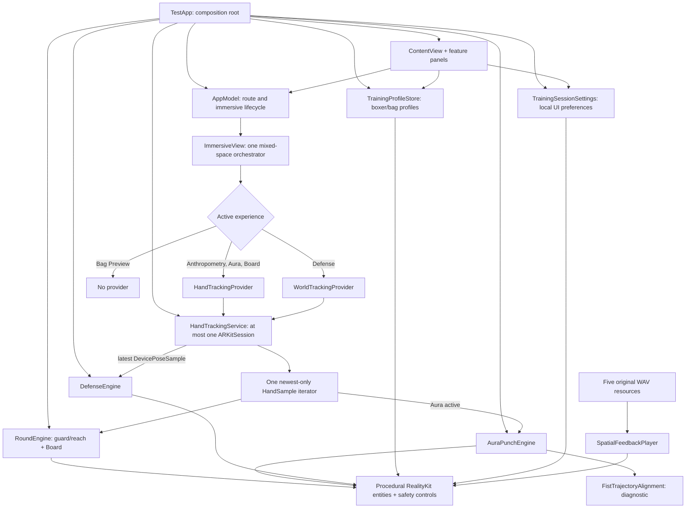

# ShadowBox MVP architecture

**Source snapshot:** reconciled final source, 8 August 2026
**Physical organization:** 27 app Swift files and 13 test Swift files
**Software verification:** quiet 05:38 snapshot: 111/111 tests passed; generic
Simulator and unsigned arm64 visionOS builds succeeded; all report 0 errors and
warnings, and the xcresult analyzer-warning field is 0. A separate Xcode
Analyze action was not run. Signed install, live tracking, comfort,
accessibility, and on-device audio playback/localization remain pending.

“Implemented” in this document means wired in source. It does not mean signed,
installed, accurate, safe, comfortable, or accepted on Apple Vision Pro.

## Architectural position

ShadowBox is a local-first mixed-reality boxing-fundamentals MVP. It keeps three
systems separate:

1. **RealityKit presentation** renders the original procedural ghost glove,
   path points, board, markers, bag proxy, defense cues, safety controls, and
   spatial-audio emitters.
2. **Human kinematics** operates on plain timestamped hand/device samples to
   derive guard, reach, path, extension, timing, target contact, and a headset-
   motion proxy.
3. **Human biomechanics** would require joints, contact, force, and reference
   sensing that the current app does not have. No force, power, effective mass,
   hip, footwork, balance, or professional-technique layer is implemented.

The user-facing product remains:

- **Anthropometry:** validated manual profile plus live guard and two controlled
  functional-reach repetitions per hand.
- **Aura Punch:** three jab/cross repetitions following an original procedural
  ghost glove, with deterministic hand-only scoring and a separate trajectory-
  shape diagnostic.
- **Reactive Strike:** six-pad Board, static non-contact Bag Preview, and
  planted-feet Defense using headset position as a head-motion proxy. Excessive
  range fails closed and requires neutral plus explicit resume/fresh countdown.

Native SwiftUI, Observation, ARKit, RealityKit, Foundation, UIKit accessibility,
QuartzCore, `simd`, `UserDefaults`, and Swift Testing cover the implemented
scope. There is no third-party package, networking layer, cloud model, Core ML
runtime, raw-camera pipeline, or authored 3D scene dependency.

## Current runtime graph



### Experience-to-provider contract

| Experience | Provider | Plain signal | Purpose |
|---|---|---|---|
| Anthropometry calibration | `HandTrackingProvider` | `HandSample` | Guard plus bilateral functional-reach capture |
| Aura Punch | `HandTrackingProvider` | `HandSample` | Reused calibration, hand path/extension/guard scoring, trajectory diagnostic |
| Reactive Board | `HandTrackingProvider` | `HandSample` | Reused/fresh calibration and deterministic jab/cross targets |
| Defense | `WorldTrackingProvider` | `DevicePoseSample` | Stationary headset-motion proxy |
| Bag Preview | None | Persisted `BagProfile` | Static non-contact visualization |

Providers are mutually exclusive. Hand-required routes request hand tracking;
Defense requests world tracking; Bag Preview starts no ARKit session. This keeps
authorization and failure states route-specific.

### Runtime sequence

1. `TestApp` creates app-lifetime instances of `AppModel`,
   `TrainingSessionSettings`, `TrainingProfileStore`, `HandTrackingService`,
   `RoundEngine`, `AuraPunchEngine`, and `DefenseEngine`, then injects the same
   instances into the main window and one mixed `ImmersiveSpace`.
2. The normal window selects a route, profile/stance, level 1–5, sound, and
   recommendation opt-in. Level selection is locked while immersion is active.
3. Safety acknowledgement gates entry. Hand-led modes require stationary,
   controlled, submaximal straight extensions; Bag/partner contact, stepping,
   spinning, full-speed, and maximum-effort punches are outside the contract.
4. `ImmersiveView` starts only the provider required by the selected route and
   remains the sole consumer of `HandTrackingService.samples`.
5. `RoundEngine` captures a still guard and two controlled extension/return
   repetitions per hand. Each hand is accepted independently; target placement
   keeps its hand-specific calibration.
6. Aura consumes the same session calibration, renders the original procedural
   ghost glove/path, captures three repetitions, and computes deterministic
   scores plus an optional trajectory diagnostic. Start is refused unless both
   hands are currently tracked.
7. After Aura completes, **Continue to Punch Board** starts Board without
   closing the mixed space. Guard, per-hand reach, forward direction, and the
   selected presentation level remain valid for that transfer.
8. Defense advances from the latest `DevicePoseSample`; Bag Preview uses no
   provider. Tracking loss pauses/invalidates dependent work rather than
   manufacturing a miss or score. Excessive Defense displacement during a cue
   or inter-cue gap cancels evidence and pauses; neutral plus explicit resume
   begins a fresh countdown/cue.
9. `SpatialFeedbackPlayer` receives logical cue/outcome state from the scene,
   not the reverse. Playback failure never changes scoring.
10. On immersive exit, world-origin-dependent calibration is erased. Completed
    summaries may remain in app memory for immediate window review but are not
    persisted.

## One-consumer tracking invariant

`HandTrackingService.samples` is an `AsyncStream<HandSample>` with
`.bufferingNewest(1)`. It is live state, not a lossless recording.

> Only `ImmersiveView` may execute `for await sample in handTracking.samples`.

- At most one ARKit session and one active provider exist.
- Exactly one task consumes the hand stream and fans accepted samples to the
  active deterministic engines.
- Feature engines expose synchronous ingestion; they do not own stream tasks.
- Non-finite, non-increasing, stale, or discontinuous inputs clear partial
  recognition or pause dependent work.
- `HandTrackingService.stop()` finishes the current stream and creates a fresh
  newest-only channel so re-entry cannot inherit a cancelled iterator.
- Future capture/analytics/ML code may not subscribe silently. It requires an
  explicit routing copy, consent, retention policy, and new decision.

## Coordinates and time

### Coordinates

- Spatial positions are metres in ARKit's right-handed origin coordinates.
- Manual profiles store canonical `Double` metres; centimetres/inches are UI
  conversions.
- Joint world position is
  `originFromAnchorTransform * anchorFromJointTransform`.
- `HandPose.fistCenter` is a finite multi-knuckle centroid, not a glove surface
  or centre of mass.
- `DevicePoseSample.position` is headset position and remains labelled a proxy,
  not face, neck, torso, balance, or body pose.
- Guard, per-hand reach direction/distance, and projected reference pace are
  bound to the current immersive origin.

Current coordinate debt remains explicit:

- initial forward qualification retains a world-axis assumption;
- Board lateral offsets are not yet based on a complete calibrated user-right
  basis;
- Bag Preview is fixed relative to the immersive origin and is not registered
  to a physical bag.

Do not claim orientation-independent placement until a shared user-relative
frame passes physical-device validation.

### Time

- Motion derivatives and drill scheduling use monotonic time, never wall-clock
  `Date`.
- Per-hand anchor capture timestamps govern trajectory order/velocity; receipt
  time governs freshness/watchdogs.
- Cue windows follow logical engine timestamps, not rendered frames or audio.
- Trajectory validation rejects non-finite/non-increasing timestamps and gaps
  beyond the configured maximum; it never bridges missing tracking.
- Defense's live timestamp-epoch compatibility remains a physical-device proof
  gate. Tests with a synthetic common epoch do not prove the live clocks match.

## Bilateral functional fit

`RoundEngine` owns live guard/reach calibration. The current functional-fit
contract is:

1. both hands visible and still at a comfortable guard;
2. two controlled extension-and-return repetitions with one hand while the
   other remains near guard, then two with the other hand;
3. each hand evaluated independently by `FunctionalCalibrationReport`;
4. accept the shorter repetition only when the pair's spread is no greater
   than the larger of the provisional 5 cm floor and 12% of the shorter reach;
5. retain hand-specific guard, direction, reach, and projected reference pace
   for targets within the session;
6. only the minimum uncapped accepted left/right reach scalar may be added to
   the local boxer profile.

Per-hand repetitions, world coordinates, direction, and pace evidence remain
session-only. These thresholds are interaction rules, not anatomy, clinical
measurement, or device-accuracy validation.

## Aura scoring and trajectory diagnostic

### Coaching/overall score

Aura's overall guide score uses only:

- path adherence: 45%;
- extension control: 30%;
- other-hand guard: 25%.

Deterministic coaching text chooses among those same observable components.
The internally calculated relative execution pace is not displayed, rewarded,
used in coaching, or included in the overall score.

### Separate trajectory-shape diagnostic

The runtime-wired diagnostic is deliberately independent from coaching/scoring:

1. Aura records the attempt fist path in memory, capped at 512 samples.
2. `FistTrajectoryAlignment` validates finite, increasing, contiguous,
   complete out-and-back paths, including start/end near guard and sufficient
   extension. Any failure returns no diagnostic.
3. Reference and attempt translate by calibrated guard and normalize by
   calibrated reach.
4. Each validated polyline is resampled to 49 equal cumulative-arc-length
   positions. Provider sample rate and execution pace therefore do not become
   shape evidence.
5. Banded constrained DTW compares the equal-density paths and yields a
   transparent 0–1 visualization aid.
6. A set-level value is shown only when every repetition produced a valid
   diagnostic. One valid trace never stands in for missing/invalid repetitions.

The value is labelled **Trajectory shape · diagnostic**, remains session-only,
does not affect coaching or overall scoring, and is not technique, full-body,
force, safety, or efficacy evidence. Physical-device calibration of its
thresholds remains pending.

## Difficulty and deterministic recommendations

`TrainingSessionSettings` owns three explicit local preferences:

- level 1–5;
- spatial-sound enabled;
- next-level recommendations enabled.

Level changes presentation only: Aura demonstration duration/path-point density
and Board/Defense cue/rest timing. Reach, target size, recognition thresholds,
score weights, and safety stay fixed.

`TrainingIntensityAdvisor` is an opt-in deterministic rule set over aggregate,
complete-set evidence. It holds after interruptions/insufficient evidence,
proposes at most one adjacent level, explains the reason, and never changes the
level until the user applies it. It is not ML, does not learn, and does not
persist evidence or recommendation instances.

## Spatial audio and haptics

`Test/Resources/Audio` contains five original mono WAV resources:

- `coach-cue.wav`
- `clean-hit.wav`
- `miss.wav`
- `paused.wav`
- `set-complete.wav`

`SpatialFeedbackPlayer` owns two RealityKit entities with
`SpatialAudioComponent`, preloads the resources, routes cue versus result
playback, exposes load errors, and stops/detaches with the scene. `ImmersiveView`
positions cues near the relevant guide/target/defense location and routes
logical state changes. The normal-window toggle and in-space **Mute sound**
action update the persisted preference; audio remains redundant to visual/text
status and never affects scoring.

Source wiring is not on-device audio acceptance. Resource loading, latency,
localization, overlap, mute, accessibility, and thermal behavior remain pending
on physical hardware. Apple Vision Pro has no native Core Haptics support; no
sound or visual effect may be described as headset haptics.

## Defense fail-closed and accessibility contracts

`DefenseSpatialBasis` is derived from the calibrated neutral headset-right
direction. Both the rendered cue and spatial-audio cue position use that same
user-relative basis, preventing contradictory left/right frames. Exceeding the
controlled displacement range during either an active cue or the inter-cue gap
cancels the cue, records an `.excessiveMovement` safety pause, and invalidates
adaptive evidence. Resume is refused until the latest pose is back inside the
neutral radius; the user must then explicitly resume into a fresh countdown.
Tracking/system interruptions and safety-range pauses are distinct result
fields. This is a software safety boundary, not proof of safe headset boxing.

The main `Window` uses content-minimum resizability. Home cards change layout at
accessibility Dynamic Type sizes and the menu/detail regions scroll. Important
fatal, pause, cue/result, transfer, and set-completion state changes post
accessibility announcements. These paths remain pending VoiceOver and
physical-headset acceptance.

## Data ownership and lifetime

| Data | Owner | Lifetime | Persisted? |
|---|---|---:|---:|
| Active/last route and immersive state | `AppModel` | App process | No |
| Unsaved drafts and safety acknowledgement | `ContentView` | View/window | No |
| Validated boxer profile, including optional conservative reach scalar | `TrainingProfileStore` | Across launches | Yes, local `UserDefaults` JSON |
| Validated bag profile | `TrainingProfileStore` | Across launches | Yes, local `UserDefaults` JSON |
| Level 1–5 | `TrainingSessionSettings` | Across launches | Yes, local `UserDefaults` |
| Sound enabled | `TrainingSessionSettings` | Across launches | Yes, local `UserDefaults` |
| Recommendation opt-in | `TrainingSessionSettings` | Across launches | Yes, local `UserDefaults` |
| Aggregate recommendation evidence and recommendation instance | `TrainingSessionSettings` | App/session memory | No |
| ARKit providers, hands, device pose | `HandTrackingService` | Active route | No |
| Guard, hand-specific reach/direction/reference pace | `RoundEngine` | Immersive session | No |
| Functional-fit per-hand repetitions/reports | `RoundEngine` | Session/app memory | No |
| Board attempts/summary | `RoundEngine` | App memory for immediate review | No |
| Aura attempt trajectories, scores, diagnostic, summary | `AuraPunchEngine` | Session/app memory | No |
| Defense neutral/cues/attempts/summary | `DefenseEngine` | Session/app memory | No |
| Room geometry, images/video, raw traces, transforms | No persistence owner | Not retained | No |

`PrivacyInfo.xcprivacy` declares the app's approved UserDefaults access. Results,
evidence, recommendation instances, traces, and world-space state must not be
slipped into preferences or profile storage.

## Physical source organization

The Xcode project uses file-system-synchronized groups. At this reconciled
final-source snapshot the app target has **27 Swift files** and the test target
has **13 Swift files**; the in-place Defense/accessibility slice changed no file
counts.

```text
Test/
├── App/
│   ├── AppModel.swift
│   ├── TestApp.swift
│   └── TrainingSessionSettings.swift
├── Domain/
│   ├── AnthropometryAssessment.swift
│   ├── TrainerDomain.swift
│   └── TrainingIntensity.swift
├── Features/
│   ├── Aura/
│   │   ├── AuraCoachingFeedback.swift
│   │   ├── AuraPanel.swift
│   │   └── AuraPunchEngine.swift
│   ├── Home/
│   │   ├── ContentView.swift
│   │   ├── ToggleImmersiveSpaceButton.swift
│   │   ├── TrainingIntensityPresentation.swift
│   │   └── TrainingSessionPresentation.swift
│   ├── Profile/
│   │   └── ProfilePanel.swift
│   └── Reactive/
│       ├── BagPreviewPanel.swift
│       ├── BoardPanel.swift
│       ├── DefenseEngine.swift
│       ├── DefensePanel.swift
│       ├── ReactivePanel.swift
│       └── RoundEngine.swift
├── Motion/
│   ├── BoxingDomain.swift
│   ├── FunctionalCalibrationReport.swift
│   └── TrajectoryAlignment.swift
├── Persistence/
│   └── TrainingProfileStore.swift
├── Reality/
│   ├── Feedback/
│   │   └── SpatialFeedbackPlayer.swift
│   └── ImmersiveView.swift
├── Resources/Audio/
│   ├── clean-hit.wav
│   ├── coach-cue.wav
│   ├── miss.wav
│   ├── paused.wav
│   └── set-complete.wav
├── Spatial/
│   └── HandTrackingService.swift
├── Assets.xcassets/
├── Info.plist
└── PrivacyInfo.xcprivacy

TestTests/
├── Domain/
│   ├── AnthropometryAssessmentTests.swift
│   └── TrainingIntensityTests.swift
├── Features/
│   ├── Aura/
│   │   ├── AuraCoachingFeedbackTests.swift
│   │   └── AuraPunchEngineTests.swift
│   └── Reactive/
│       ├── BoardTargetTests.swift
│       ├── DefenseEngineTests.swift
│       └── RoundEngineTests.swift
├── Motion/
│   ├── BoxingDomainTests.swift
│   ├── FunctionalCalibrationReportTests.swift
│   └── TrajectoryAlignmentTests.swift
├── Persistence/
│   └── TrainingProfileTests.swift
├── Smoke/
│   └── TestTests.swift
└── Spatial/
    └── HandTrackingTypesTests.swift
```

## Layer ownership and dependency rules

These are logical boundaries inside one target, not separately compiled modules.

| Layer | Owns | Must not own |
|---|---|---|
| `App` | Composition, route/session preference instances | Scoring or motion math |
| `Domain` | Routes, units, profile assessment, training-intensity vocabulary/rules | ARKit, RealityKit, storage implementation |
| `Motion` | Samples, geometry, punch detection, calibration QA, trajectory comparison | UI, ARKit, RealityKit, persistence |
| `Spatial` | Provider lifecycle and conversion to plain values | Scores, feature policy, UI, persistence |
| `Features` | User flows, deterministic engines, result presentation | Raw ARKit providers or hidden networking |
| `Reality` | Entities, audio, attachments, sample routing, immersive lifecycle | Scoring truth or persisted traces |
| `Persistence` | Validated boxer/bag profile encoding/storage | Samples, results, recommendations, world state |
| `Resources` | Original local feedback audio | Scoring logic or third-party unattributed media |
| `Tests` | Deterministic/boundary contracts | Hardware assumptions presented as device proof |

ARKit types remain inside `Spatial`; RealityKit types remain inside `Reality`;
Motion utilities remain testable without hardware. Rendering, animation, and
audio completion never redefine logical scoring events.

## Explicitly not implemented

- raw passthrough-camera frames or a consumer camera-entitlement workaround;
- full-body, shoulder/elbow, torso, pelvis/hip, knee/foot, balance, plantar-
  pressure, ground-reaction, force, effective-mass, power, injury, or medical
  measurement;
- hooks, uppercuts, learned punch classification, professional-technique
  grading, a rigged 3D coach, sparring NPC, or Apple Persona NPC;
- Core ML inference/training, cloud LLM, accounts, networking, social play, or
  remote coaching;
- native AVP haptics;
- scene reconstruction/furniture clearance or automatic safe-zone proof;
- physical-bag alignment/motion/contact/impact or iPhone/Watch/belt companion;
- workout/result history, analytics, CloudKit, trace recording/replay/export;
- device-validated thresholds, orientation independence, audio runtime, or
  training efficacy;
- Swift 6 language mode (`SWIFT_VERSION` remains 5.0);
- a reusable multisport package extracted before the boxing loop is validated.

## Architecture acceptance checks

A change conforms only if:

- one mixed `ImmersiveSpace` remains the training space;
- at most one ARKit session/provider is active and exactly one task consumes the
  newest-only hand stream;
- provider permission matches the selected route;
- ARKit and RealityKit types do not leak into deterministic Motion utilities;
- tracking loss pauses/invalidates work rather than creating a miss/score;
- difficulty never changes body fit, scoring, thresholds, or safety;
- execution pace remains internal, unscored, and undisplayed;
- trajectory shape remains separate, fail-closed, session-only, and excluded
  from coaching/overall scoring;
- audio remains redundant and cannot affect scoring or safety truth;
- Aura start remains gated on both hands currently tracked;
- Defense excessive-range motion fails closed in cues and gaps, and only
  neutral plus explicit resume may start a fresh countdown;
- Defense visuals and spatial audio use the same calibrated cue basis;
- resizable/scroll-safe layouts and state announcements remain available;
- only boxer/bag profiles and the three explicit UI preferences persist;
- world-origin-dependent state is erased on immersive exit;
- no biomechanics, device, efficacy, test-count, or audio-runtime claim outruns
  its recorded evidence;
- the final recursive rerun discovers every test after structural changes.
